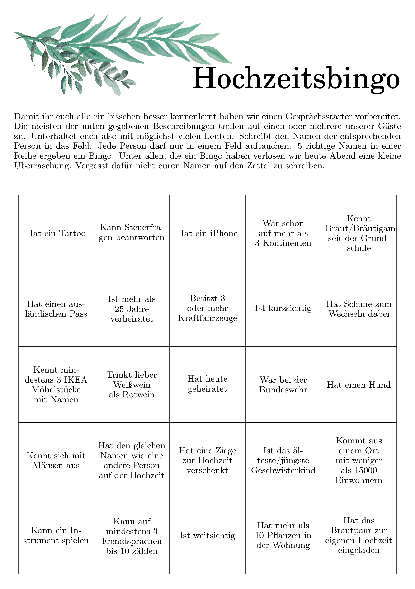

# Hochzeitsbingo
Generate Bingo cards for your wedding guests to play.
This can be a good conversation starter for people to get to know each other.

## Usage
Everything you need to generate the shown bingo cards is contained in `document.tex`.
This LaTeX file generates a single page of size a5 with `header.pdf` as header, and the [description](https://github.com/NiklasKroeger/hochzeitsbingo/blob/master/document.tex#L87-L94) below it.
The header was generated from the also included `header.svg` file with inkscape.
If you want to change the title I recommend you do so in inkscape and export a new `header.pdf`.

The entries for each field are picked at random from the [randomwords](https://github.com/NiklasKroeger/hochzeitsbingo/blob/master/document.tex#L20-L69) variable.
So this would be the place for you to define your own fields.
Entries are separated with a semicolon.

The center field is often a  special "free" field.
It can be changed with the [freifeld](https://github.com/NiklasKroeger/hochzeitsbingo/blob/master/document.tex#L70) command.
If the "special" cell in the middle is not desired, [the if command](https://github.com/NiklasKroeger/hochzeitsbingo/blob/master/document.tex#L105) checking for the middle square can be commented out accordingly.

Also included in this repo is a small shell script that can be used to generate a number of different, random bingo cards.
`generate.sh` is called with the number of cards you want to generate.
It will go ahead, create the desired number of cards at random and merge all the pdf files into `out.pdf`.
This will be of papersize a4 and containt two bingo cards side by side for easier printing.
